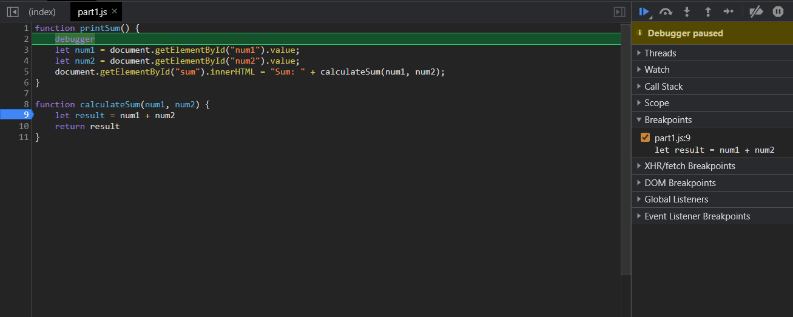
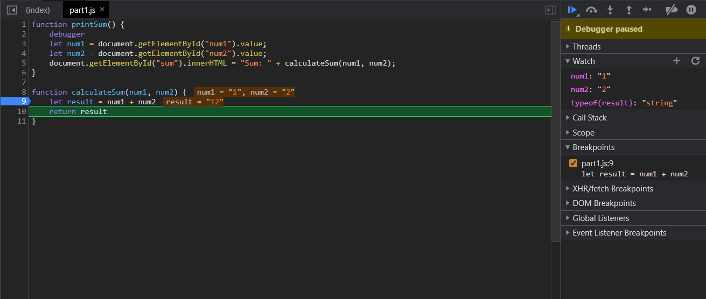
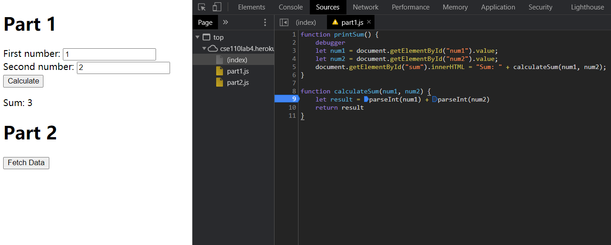

<pr>
[DevTools - Debugging]

1. Screenshot of the list of breakpoints:

2. Screenshot of the watch expressions list:

3. What was the bug?
   Answer: The bug is that input numbers are not converted from strings into numbers. This bug will cause the + operator to perform a string concatenation instead of the expected numerical addition operation.

4. Screenshot of the fix:

[DevTools - Network Tab]

1. citylots.json
2. part2.js
3. 11.7MB
4. 70ms
5. Mozilla/5.0 (Windows NT 10.0; Win64; x64) AppleWebKit/537.36 (KHTML, like Gecko) Chrome/88.0.4324.104 Safari/537.36
6. Apache
7. Tue, 26 Jan 2021 22:14:13 GMT
8. application/json
9. fetchData
</pr>
